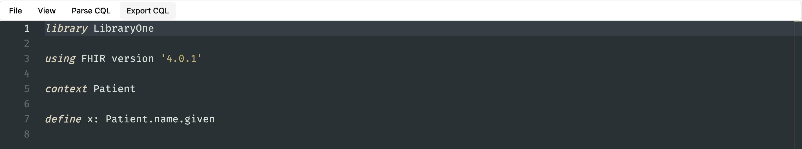

# Export CQL as a FHIR Library

After you coded the CQL, you can export it as a FHIR library.

This will create a FHIR endpoint with a link to a FHIR `library` resource generated from the CQL.

:::tip
Read more about the FHIR library resource. 🔥 [FHIR Library Resource](https://hl7.org/fhir/library.html)
:::

From the editor, you can get the link to the FHIR endpoint by clicking the `Export CQL` button.

This will open up a popup with a link to the FHIR endpoint to the `library` resource.

You can copy this link, and then share it with a FHIR server like HAPI, or any FHIR server that can process it as a `library` resource.
