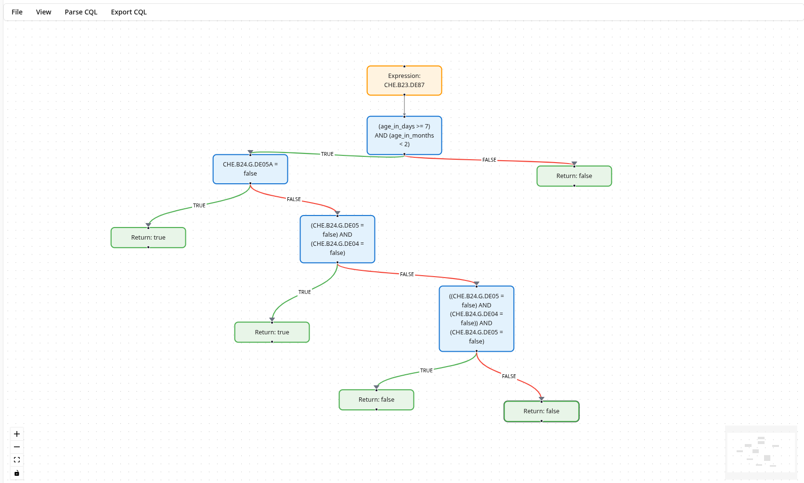

# Graph Mode

You can now visualize CQL logic as an interactive graph using the graph mode in the Spark Editor.

This allows anyone to easily understand and review coded clinical logic by visualizing it as a graph and making changes within the editor.

:::tip
The graph mode currently does not support the full CQL specification and is limited to selected logical elements, but more features will be added to cover more of the specification.
:::

## Opening the Graph Mode

To navigate to the **Graph Mode** within the editor:

- Click the **View** menu.
- From the dropdown menu, click **Graph Mode**.

This will change your editor from the text-based editor to the Graph Mode.

You can navigate the graph and zoom in and out and see the content of the CQL logic.

## Navigating Back to the Editor

To navigate back to the editor from the **Graph Mode**:

- Click the **View** menu.
- From the dropdown menu, click **Editor Mode**.
