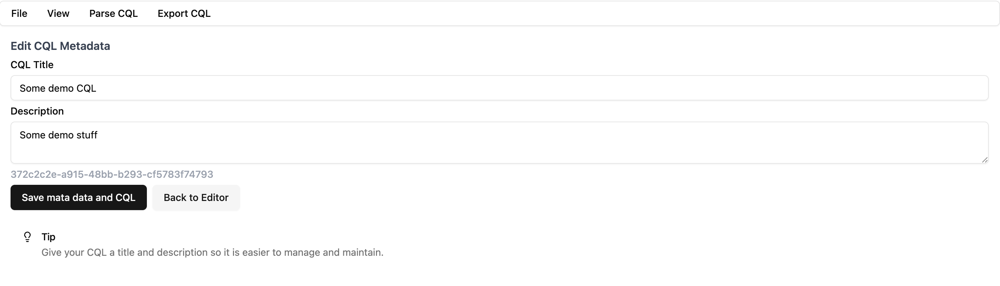

# Metadata Mode

The metadata mode will allow you to set metadata for the CQL you write. This will include a title and a description.

- The title will be the `title` attribute of the FHIR `library` resource.
- The description of the metadata will be used as the `description` attribute of the FHIR `library` resource.

To navigate to the metadata mode of the CQL,

- You can click `View` -> `Metadata Mode`
- Use the shortcut key combination `⌘ + m` or `⌃ + m`

This will open the metadata page for the CQL. If you are creating a new CQL, this will be empty and you can write a title and / or a description for the new CQL you are writing.

:::tip
Read more about writing a new CQL here
:::

If you are editing an existing CQL, you can edit the metadata in the metadata page.

After you entered or modified the title and description in the metadata page, you can click the **Save metadata and CQL** button, this will save the metadata and CQL.
