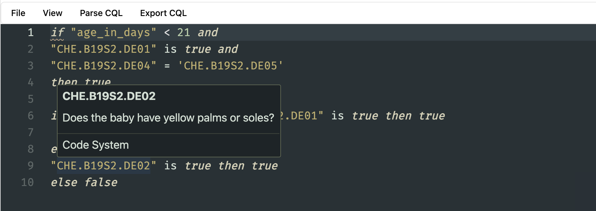

# Writing CQL in the Editor

You can start using the editor straight away, even without uploading a CodeSystem. However, you won't get the auto-complete. But you can still use the built-in documentation to understand the meaning of different keywords.

You can even start writing CQL if you are not in an active project. But you will need to be in an active project to save the CQL.

:::tip
Add a FHIR CodeSystem to your project to auto-complete the codes. Read how to add a [CodeSystem](/terminology/concepts/managing-concepts).
:::

Once you add a CodeSystem you will automatically get the auto-complete based on the concepts within the CodeSystem within the editor.

## How to see the meaning of a keyword?

If you would like to check the meaning of a keyword according to the CQL documentation, you can simply hover over that keyword and the editor will show the definition of that keyword for you according to the CQL documentation.

## How to see the meaning of a concept?

If you have a CodeSystem (Concepts) added to your project you can hover over these concepts, and similar to a keyword based on the documentation, you will see the definition of a concept based on the CodeSystem.

## How to check for a syntax error in a CQL?

When you are writing your CQL, the editor will automatically check for any syntax errors as you type. For example, unclosed brackets, any syntax errors that won't meet the CQL language rules.

**If there is an error, you will see an underline within the CQL editor at the position of the syntax error.**

If you want to know what's the error, you can simply hover over the underlined word and a popup will show the syntax error according to the CQL language specification.

