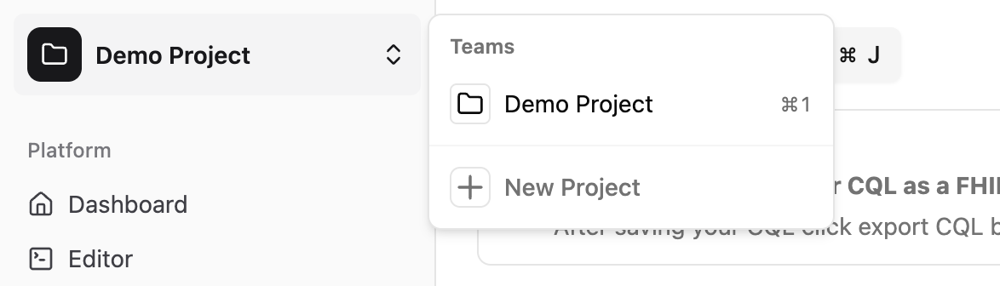
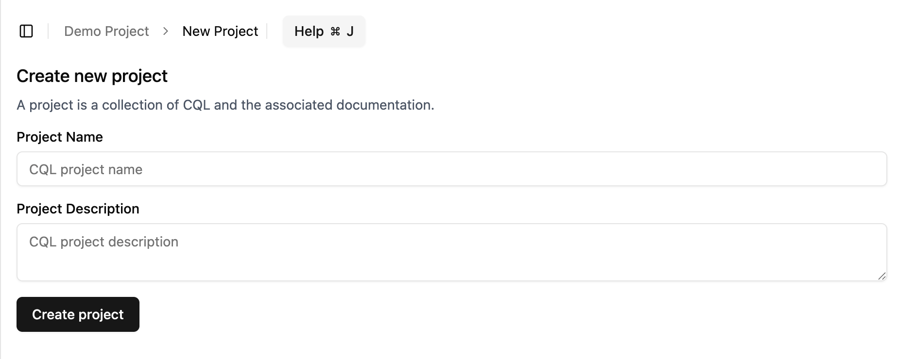

# Projects

A project is a collection of CQL and a place where users can collaborate on writing and managing a CQL project.

To give you an idea of what a project looks like, you will be automatically added to a demo project when you **sign in** to the CQL Editor.

::: tip
The first thing you will have to do after signing up is create a project and add your collaborators.
:::

## Creating a project

There are several ways to create a project in the CQL Editor:

- Using the left sidebar
- Using the dashboard

### Using the left sidebar

If you are already in a project, you can go to the `Project Switcher` on the left sidebar and click the `New Project` button.

This will navigate you to the New Project page.

There you can give your project a name and a description (_both fields are required_). After providing the name and description, click the `Create Project` button.

You will see a small **popup** appear upon successful creation of your project. Your project will be added to the `Project Switcher`, and you can now select your newly created project and switch to it.

If you are not in an active project, you will also see two buttons appear on the sidebar. One option will be to navigate to the New Project page.

TODO: Insert a screenshot of the left sidebar project create button

From there, you can also create a new project by following the steps mentioned above.

### Using the dashboard

If you navigate to the dashboard, it will show a list of all the projects you have access to.

At the very end of the list, there is a button to create a new project. Clicking this link will navigate you to the New Project page.

TODO: Insert a screenshot of the dashboard with the button visible

From there, you will also be able to create a new project as mentioned above.
