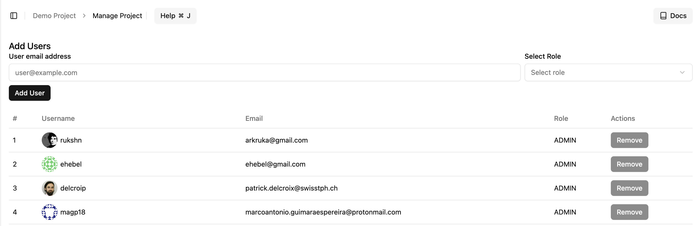

# Manage Your Project

You can manage a project by navigating to the `Manage Project` page when you are in an active project.

If you don't have an active project selected, you will first have to select a project before managing it.

::: tip
Read more about switching between different projects [here](/projects/switching-project).
:::

## Adding Users to a Project

From the project management page, you can add new users to your project. After you add a new user to a project, they will be able to collaborate with you on authoring CQL.

## Deleting a Project

If you want to delete a project, you can navigate to the `Manage Project` page. At the bottom, you will see the danger zone, where you will have the option to delete the project.

::: info
You will need administrator privileges to delete a project.
:::

::: danger
Deleting a project will also delete all its settings and, importantly, the CQL. This action **is irreversible**.
:::
