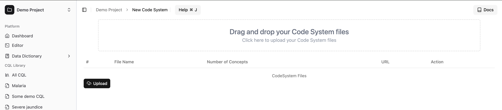
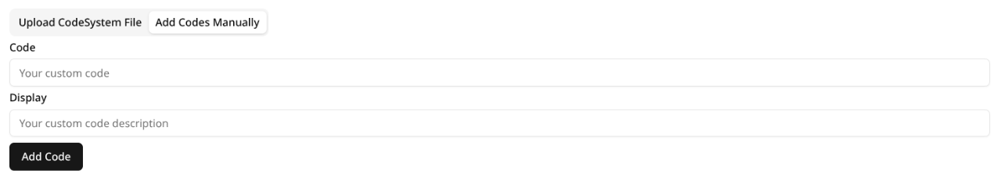
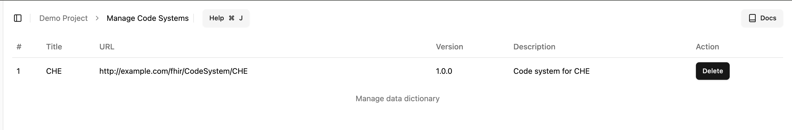

# Managing Your Codes

## How to add concepts to Spark Editor?

When you start a new CQL project, the first thing you should do is to populate the data dictionary before you start writing CQL.

This can be done two different ways

- Bulk uploading codes by **uploading** a FHIR `CodeSystem` resource as a `json` file (containing all the `concepts`) to the Spark editor.
- Manually add individual codes to the project

### Bulk uploading a data dictionary as a FHIR CodeSystem

To populate the data dictionary using a FHIR CodeSystem,

- Navigate to the `New CodeSystem` page from the left sidebar: `Data Dictionary` -> `New CodeSystem`

**There are two ways to upload a `CodeSystem` file:**

- You can drag and drop one or more `json` files onto the drag-and-drop area on the new CodeSystem page.
- Click on the drag-and-drop area, and a file selection dialog box will open.
  - Select the `json` files you want to upload and click 'Open'.
- Whether you drag and drop or select the `CodeSystem` files, if successfully selected, the table below will show the `name`, `url`, and the number of concepts within each CodeSystem file.

**If you accidentally select a `CodeSystem` file that you don't want to upload, you can remove it by clicking the `x` button at the end of its row.**

- After selecting your files, click the **Upload** button. Your `CodeSystem` files will be uploaded, and all the `concepts` within them will become available for use in the Spark Editor.

### Adding individual codes to the data dictionary of a project

You can now add individual codes to the data dictionary of a project, this allows you to add codes that are not available in the FHIR CodeSystem file, or selectively add codes to the data dictionary.

- In order to add codes, you can navigate to the **New CodeSystem** page and click on the **Add Codes Manually** option
- This will open up the form to add codes manually
- Enter the `Code` and it's definition by filling the `Display`
- Click `Add Code` button to add the code to the data dictionary

## Updating the concepts

The concepts used in a CDSS project can change over time; new concepts might be added, and old concepts might be removed. When writing CQL, you will need to keep the concepts **up-to-date** within the Spark Editor to ensure they are available for parsing and autocompletion.

To update your list of concepts, navigate to the same page used for uploading a new `CodeSystem` (`Data Dictionary` -> `New CodeSystem`) and upload the updated `CodeSystem` FHIR resource `json` file containing the new or modified codes.

In FHIR, a `CodeSystem` is uniquely identified by its **canonical** URL. Ensure that the updated `CodeSystem` file has the same canonical `url` attribute as the original `CodeSystem` you are replacing.

::: warning
If the updated `CodeSystem` does not have a **canonical** `url` matching the original one, a new CodeSystem will be created instead of updating the existing one, potentially leading to **duplication** of codes.
:::

## Deleting concepts

To delete concepts, you will have to delete the `CodeSystem` that the concepts are associated with.

In order to delete **a** `CodeSystem`, you first have to navigate to the **Manage Data Dictionary** page from the left sidebar (`Data Dictionary` -> `Manage Data Dictionary`).

And there you will see all the code systems **associated** with your project, and under the **Action** section, you will find the delete button.

You can click the delete button to delete any `CodeSystem` that you don't plan on using.

::: tip
Deleted a CodeSystem by **accident**? Don't worry, you can always go back and add the CodeSystem again.
:::
